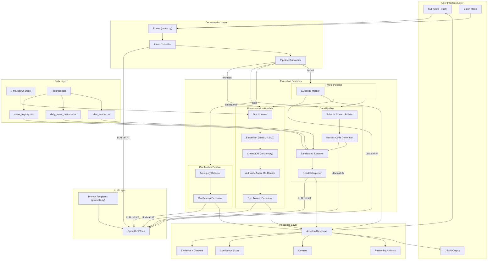
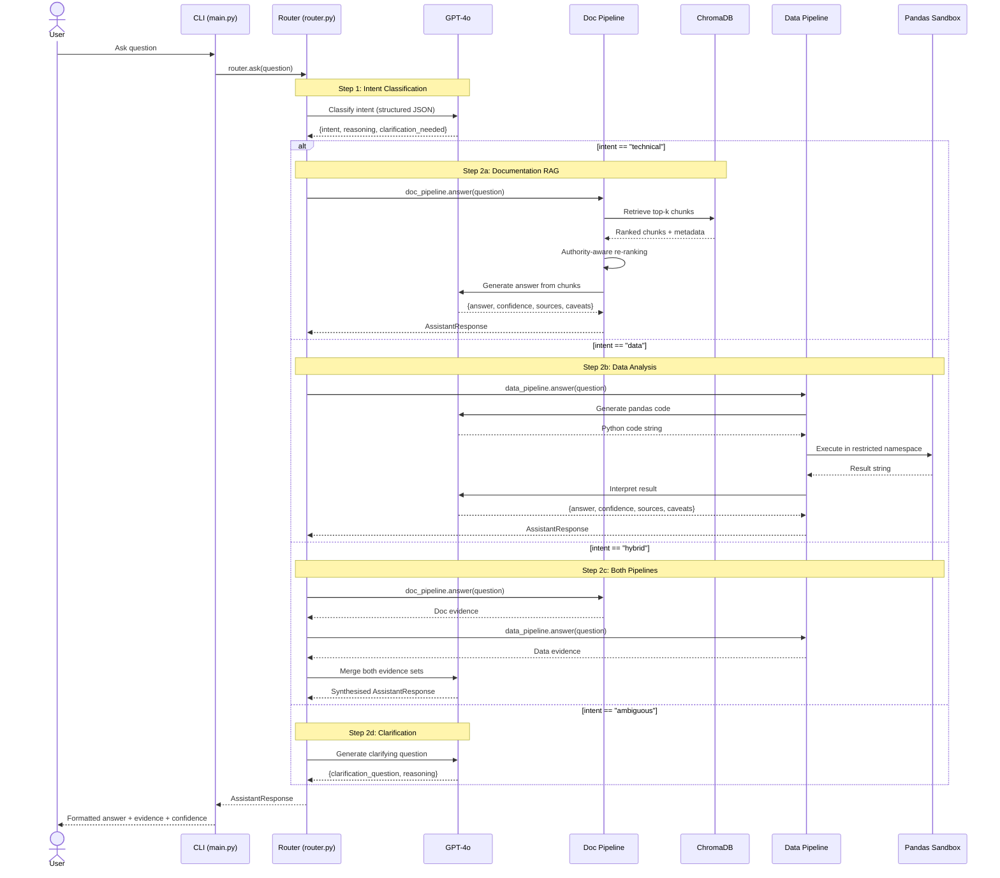
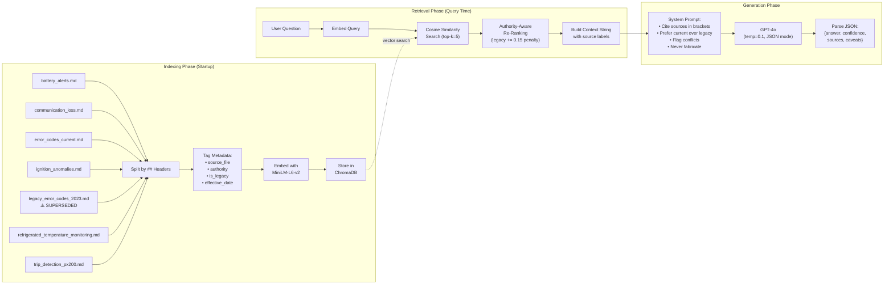
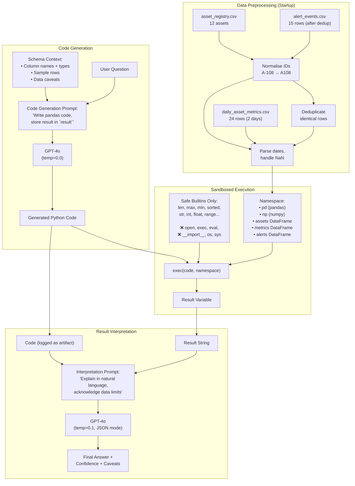
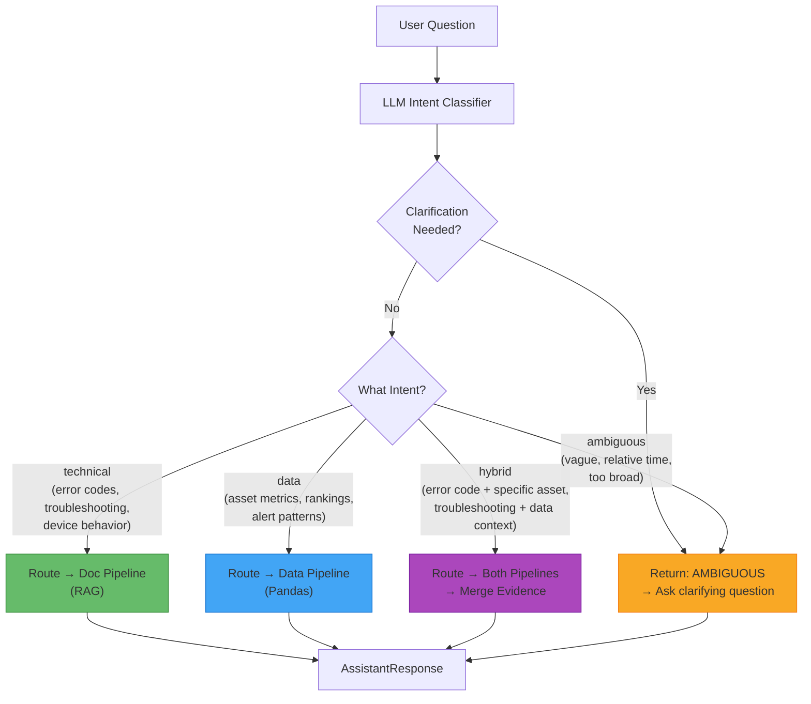
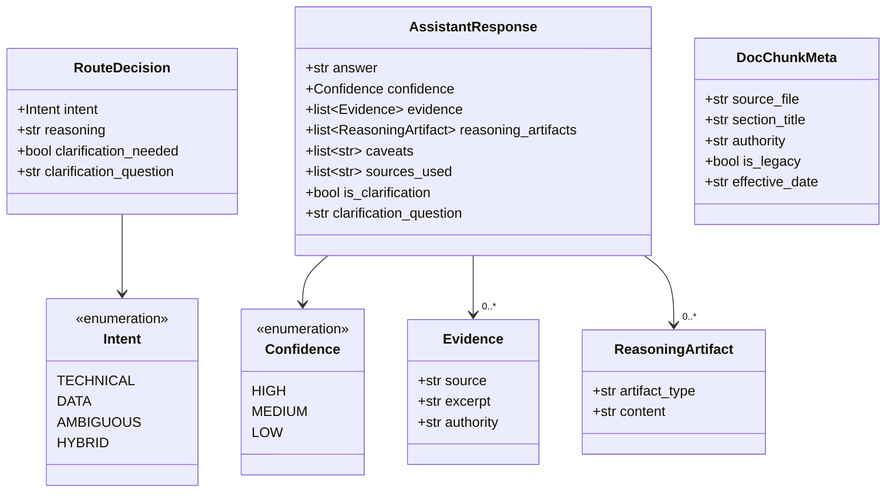
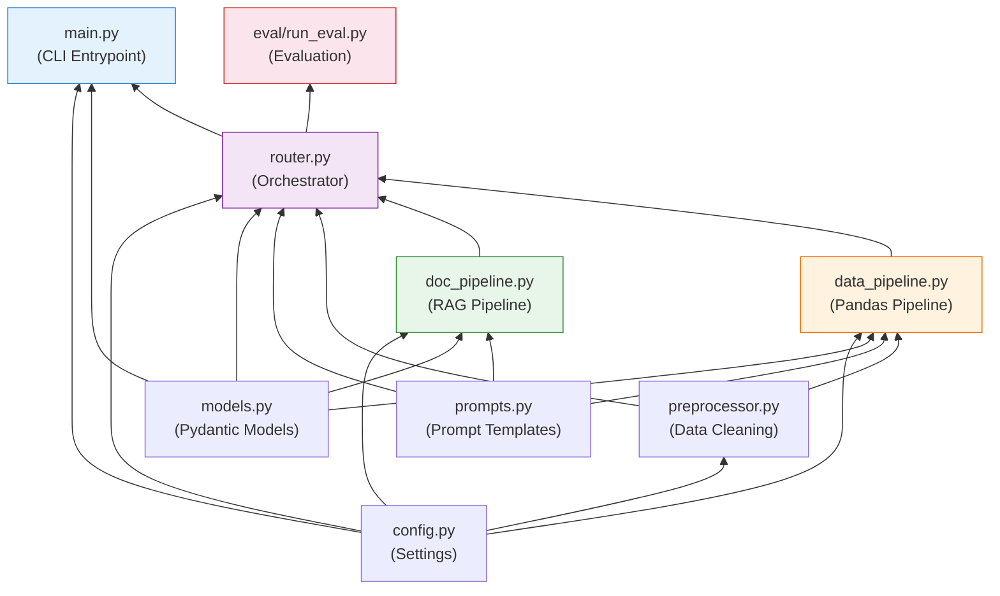
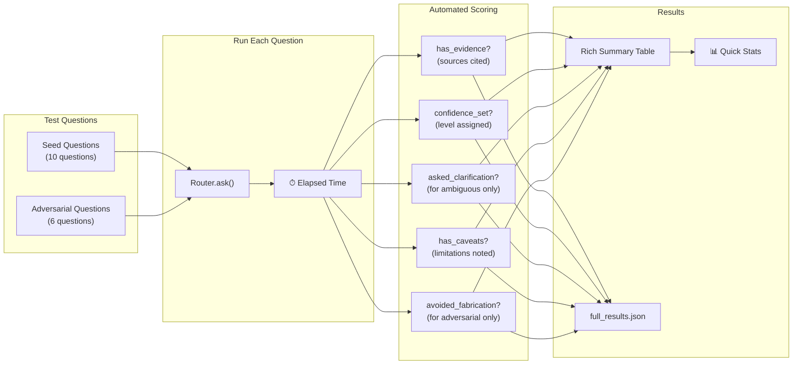

# Architecture Diagrams

## 1. High-Level System Architecture

---

## 2. Request Processing Flow (Sequence Diagram)

---

## 3. Documentation Pipeline Detail

---

## 4. Data Pipeline Detail

---

## 5. Intent Classification Decision Tree

---

## 6. Data Model Relationships

---

## 7. Module Dependency Graph

---

## 8. Evaluation Pipeline

